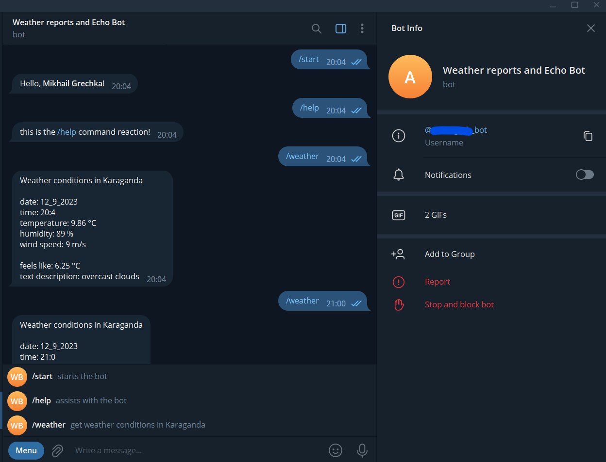
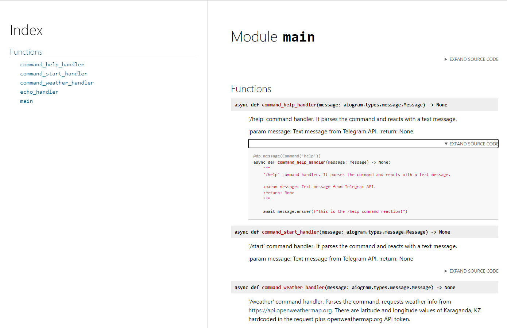

**AioGram Weather Reports and Echo Telegram Bot**

This is a simple Telegram bot with just a few features:
1. echoing a user's messages (sending back to a user);
2. printing current weather conditions 
in a single hardcoded city (Karaganda, Kazakhstan);
3. handles three commands (/start, /help, /weather).

**Some technical details**

The bot is based on [AioGram](https://docs.aiogram.dev/en/latest/)
asynchronous framework for Telegram Bot API.   

Firstly, the code starts an event loop and a dispatcher, which monitors
(long polling) messages from users. Once there is a new message in the chat
the bot handles it with async echo_handler function and 
reacts with sending the message back to the user.
If a message consists of a command '/weather' the code runs 
async command_weather_handle function, which creates an https request, 
gets current weather conditions details from [openweather](https://home.openweathermap.org/)  
and prints the data in the chat.

Basically, this is it as of Sept, 13, 2023 :)

For extra details, please inspect docs_in_html folder in the repository 
or the source code itself. 

